# 2. App Screens & Flows

> [!IMPORTANT]
> **Design Compliance**: All UI implementation must strictly follow the designs in `guidelines/0-screens-designs`.

## 1. Navigation Architecture

The app uses a **Bottom Navigation Bar** as the primary means of moving between main sections.

```mermaid
graph TD
    User((User)) --> Home["Início (Home)"]
    User --> Music["Músicas (Music)"]
    User --> Cards["Cards (Flashcards)"]
    User --> Favs["Favoritos (Favorites)"]

    subgraph "Main Tabs"
    Home
    Music
    Cards
    Favs
    end
```

---

## 2. Screen Details & Flows

### 🏠 Home (Início)

**Reference**: `1_homescreen.png`

The central hub for learning. It displays the user's progress and the full curriculum.

**UI Components**:

- **Header**: Shows the app name "Betel", date, and a welcoming title "Vamos aprender sobre Deus".
- **Current Lesson (Hero Card)**: A prominent card displaying the user's current progress.
  - Features a background image, lesson number ("4"), title, and progress bar.
  - Includes a "Play" button to quickly resume.
- **Lesson List**: A vertical list of all catechism lessons.
  - **Status Indicators**:
    - **Checkmark (Green/Yellow)**: Completed lessons.
    - **Number (Yellow)**: Active/Current lesson.
    - **Lock Icon (Grey)**: Locked/Future lessons.

**Interactions**:

- **Tap "Lição Atual" Card**: Navigates to the **Lesson Details** screen for that specific lesson.
- **Tap a Lesson in List**:
  - If **Unlocked**: Navigates to **Lesson Details**.
  - If **Locked**: Shows locked state/toast (implicit).
- **"Ver tudo"**: Expands to full lesson list (if applicable).

### 📚 Lesson Details

**Reference**: `2_lição.png`, `3_lição.png`

Features rich text, scripture, and audio for a specific catechism question.

**UI Components**:

- **Header**: Navigation back, Favorite toggle, and Lesson Number tag (e.g., "LIÇÃO 4").
- **Content**:
  - Title and theological category (e.g., "Teologia Sistemática").
  - Explanatory text with scripture references (e.g., 1 Corinthians 10:31).
  - Engaging imagery related to the topic (e.g., galaxy/stars for creation/glory).
- **Audio Player**: A persistent bottom player allowing listening to the lesson content ("Tocando Agora").
- **Back Button**: Returns to Home.
- **Favorite Icon**: Toggles status in Favorites tab.
- **Content Scroll**: Users scroll vertically to read the full theological explanation.

### 🎵 Music (Músicas)

**Reference**: `4_musicas.png`

A dedicated section for learning through song.

**UI Components**:

- **Search**: Bar to filter songs by theme or number.
- **Playlist**: List of tracks corresponding to catechism questions.
  - Each track shows the Question (Title) and Answer (Subtitle).
  - Play/Pause controls integrated into the list items.
- **Global Player**: Mini-player at the bottom to control playback across the app.

**Interactions**:

- **Search Bar**: Filters the song list.
- **Play Button (on item)**: Starts playing that specific track. Updates the mini-player.
- **Mini Player**: Appears at bottom when audio is active. Tapping it might expand to a full player (standard pattern, though not explicitly shown in design, implied by distinct player controls).

### 🧠 Flashcards (Cards)

**Reference**: `5_flashcards.png` (Dashboard), `6_flashcards.png` (Front), `7_flashcards.png` (Back)

This feature has the most complex interaction flow (Study Session).

#### Flow: Study Session

```mermaid
sequenceDiagram
    participant User
    participant Dashboard as Cards Dashboard
    participant Study as Study Mode (Front)
    participant Answer as Study Mode (Back)

    User->>Dashboard: Select Deck ("Começar Sessão")
    Dashboard->>Study: Enter Study Mode
    Note over Study: Shows Question (Card Front)
    User->>Study: Tap "Revelar Resposta"
    Study->>Answer: Flip Card / Show Answer
    Note over Answer: Shows Answer & Buttons
    alt User knows it
        User->>Answer: Tap "Já sei"
        Answer->>Study: Next Card (Recorded as Success)
    else User doesn't know
        User->>Answer: Tap "Ainda não sei"
        Answer->>Study: Next Card (Recorded as Retry)
    end
```

**Screens**:

1. **Dashboard (`5_flashcards.png`)**:
    - **Daily Review**: "Vamos praticar?" section encouraging daily streaks.
    - **Decks**: List of flashcard decks corresponding to lessons.
    - **Status Tags**: "Dominado" (Mastered), "Revisar" (Review), "Novo" (New).
    - "Começar Sessão" (Big CTA): Starts review of due cards.
2. **Front (`6_flashcards.png`)**:
    - Clean interface focusing on the question (e.g., "Como podemos glorificar a Deus?").
    - "Revelar Resposta" button is prominent.
3. **Back (`7_flashcards.png`)**:
    - Shows the answer text.
    - **Self-Evaluation Buttons**:
        - "X Ainda não sei" (I don't know yet) - Red/White.
        - "✓ Já sei" (I already know) - Yellow.
    - **Progress**: visual indicator of cards completed in the session.

### ❤️ Favorites (Favoritos)

**Reference**: `8_favoritos.png`

Quick access to bookmarked content. Lists favorited lessons or songs for easy retrieval.

**Interactions**:

- **Tap Item**: Navigates to its respective detail view (Lesson or Music Player).
- **Play Button**: If it's a song/audio lesson, plays immediately.
